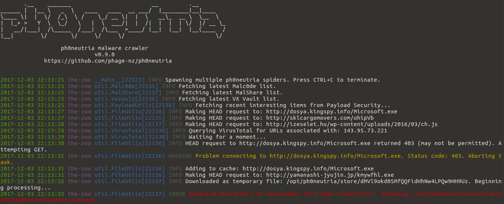
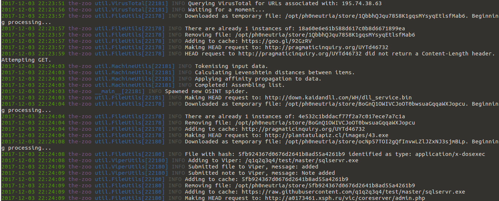
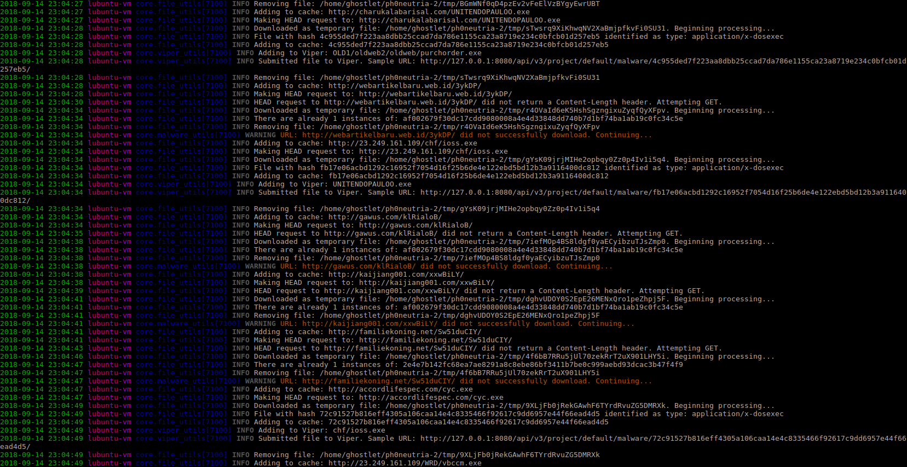
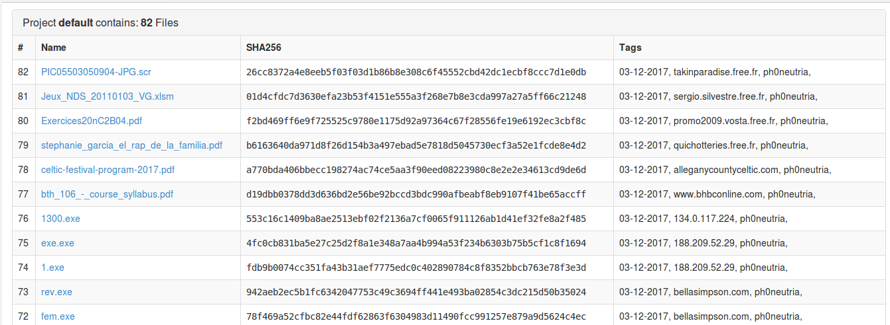

# ph0neutria #
**ph0neutria malware crawler  
v1.0.1  
https://github.com/phage-nz/ph0neutria**

**Note:** This project is not actively maintained.

### About ###
ph0neutria is a malware zoo builder that sources samples straight from the wild. Everything is stored in Viper for ease of access and manageability.  

This project was inspired by Ragpicker (https://github.com/robbyFux/Ragpicker, formerly known as "Malware Crawler"). However, ph0neutria aims to:  
- Limit the scope of crawling to only frequently updated and reliable sources.  
- Maximise the effectiveness of individual indicators.  
- Offer a single, reliable and well organised storage mechanism.  
- Not do work that can instead be done by Viper.  

What does the name mean? "Phoneutria nigriventer" is commonly known as the Brazillian Wandering Spider: https://en.wikipedia.org/wiki/Brazilian_wandering_spider  


### Sources ###
As of version 1.0.0 all sources are created as 'plugins', found in the plugin sub-directory of the core scripts folder. Default sources are:  
- 0xffff0800's Malware Library (credit: http://0day.coffee).  
- CleanMX (requires approved user-agent).  
- Cymon, which includes: Abuse.ch trackers, Bambenek C2 feed, Cyber Crime Tracker, Malc0de, URLVir and VX Vault.  
- Hybrid Analysis (requires vetted API key).  
- OTX.  
- Shodan, using the Malware Hunter search facility.  
- URLhaus.  

Each plugin has parameters that must be completed prior to operation. You'll find these at the top of each plugin file.  

VirusTotal is a core component of ph0neutria that cannot be disabled. IP lists are fed into it to discover URL's that are known for the IP's. If you have a standard 5 request/minute API key then I'd encourage being conservative with what you feed it. You can do this by:
- Reducing the number of Cymon feeds.  
- Reducing your OTX subscription count.  
- Setting the Hybrid Analysis SCORE_MIN parameter to 100.  


### Screenshots ###
  
  
  
  
  
  


### Version Notes ###
- **0.6.0:** Tor proxying requires pysocks (pip install pysocks) and at least version 2.10.0 of python requests for SOCKS proxy support.  
- **0.9.0:** OSINT functionality pulled from Phage Malware Tracker (private project) - requires VirusTotal API key. More robust retrieval of wild files. Local URL and hash caching (reduces API load).  
- **0.9.1:** Updated to use V3 Viper API. No longer compatiable with V2.  
- **1.0.0:** Major update. Pull from Safari Guide malware pipeline. Plugin architecture. Python 3.0.  
- **1.0.1:** Source update (added 0xffff0800's library). Samples can now be tagged with VirusTotal sourced classification.  


### Installation ###
The following script will install ph0neutria along with Viper and Tor:  

```
wget https://raw.githubusercontent.com/phage-nz/ph0neutria/master/install.sh  
chmod +x install.sh  
sudo ./install.sh  
```

Simple as that!

#### Optional: ####
Configure additional ClamAV signatures:  

```
cd /tmp  
git clone https://github.com/extremeshok/clamav-unofficial-sigs  
cd clamav-unofficial-sigs  
cp clamav-unofficial-sigs.sh /usr/local/bin  
chmod 755 /usr/local/bin/clamav-unofficial-sigs.sh  
mkdir /etc/clamav-unofficial-sigs  
cp config/* /etc/clamav-unofficial-sigs  
cd /etc/clamav-unofficial-sigs
```

Rename os.<yourdistro>.conf to os.conf, for example:  

```
mv os.ubuntu.conf os.conf  
```

Modify configuration files:  
- **master.conf:** search for "Enabled Databases" and enable/disable desired sources.  
- **user.conf:** uncomment the required lines for sources you have enabled and complete them. user.conf overrides master.conf. You must uncomment user_configuration_complete="yes" once you've completed setup for the following commands to succeed.  

For more configuration info see: https://github.com/extremeshok/clamav-unofficial-sigs  

```
mkdir /var/log/clamav-unofficial-sigs  
clamav-unofficial-sigs.sh --install-cron  
clamav-unofficial-sigs.sh --install-logrotate  
clamav-unofficial-sigs.sh --install-man  
clamav-unofficial-sigs.sh  
cd /tmp/clamav-unofficial-sigs  
cp systemd/\* /etc/systemd  
cd ..  
rm -rf clamav-unofficial-sigs*  
```

It'll take a while to pull down the new signatures - during which time ClamAV may not be available.


### Usage ###
Take precautions when piecing together your malware zoo:  
- Do not disable Tor unless replacing with an anonymous VPN.
- Operate on an isolated network and on dedicated hardware.
- Only execute samples in a suitable Sandbox (refer: https://github.com/phage-nz/malware-hunting/tree/master/sandbox).
- Monitor for abuse of your API keys.

Ensure Tor is started:  

`service tor restart`

Start the Viper API and web interface:  

```
cd /opt/viper  
sudo -H -u spider python3 viper-web
```

Take note of the admin password that is created when Viper is started. Use this to log into `http://<viper IP\>:<viper port>/admin` (default: `http://127.0.0.1:8080/admin`) and retrieve the API token from the Tokens page.  

The main Viper web interface will be available at `http://<viper IP>:<viper port>` (default: `http://127.0.0.1:8080`).  

- Complete the config file at: `/opt/ph0neutria/core/config/settings.conf`  
- Complete the parameters at the top of each plugin. If you wish to disable the plugin, set DISABLED = True: `/opt/ph0neutria/core/plugins/*.py`   

Start ph0neutria:  

```
cd /opt/ph0neutria  
sudo -H -u spider python3 run.py
```

You can press Ctrl+C at any time to kill the run. You are free to run it again as soon as you'd like - you can't end up with database duplicates.

To run this daily, create a script in /etc/cron.daily with the following:  

```
#!/bin/bash  
cd /opt/ph0neutria && sudo -H -u spider python3 run.py*
```

### Tags and Notes ###
Tags:  
**{1},{2},{3}**  

- Date stamp.  
- Sample domain.  
- Host ASN.  
- Host country.  

Notes:  
**{1)({2}) via {3}**

- Sample URL.  
- Host IP address.  
- URL source.  

The original name of the file forms the identifying name within Viper.


### References ###
- http://docs.cymon.io/- Cymon API documentation.  
- https://www.hybrid-analysis.com/docs/api/v2 - Hybrid Analysis API documentation.  
- http://malshare.com/doc.php - MalShare API documentation.  
- https://otx.alienvault.com/api - AlienVault OTX API documentation.  
- https://urlhaus.abuse.ch/api/ - URLhaus API documentation.  
- https://developer.shodan.io/api - Shodan API documentation.  
- http://viper-framework.readthedocs.io/en/latest/usage/web.html - Viper API documentation.  
- https://developers.virustotal.com/v2.0/reference - VirusTotal API documentation.  
